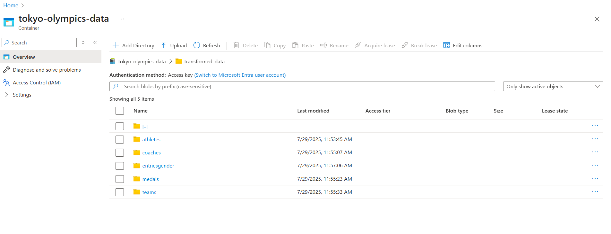

# Tokyo-Olympics-DE-Project

## Description
This project outlines a complete data engineering and analytics workflow using the Tokyo Olympic dataset. Beginning with a CSV file hosted on GitHub, the data is ingested into the Azure ecosystem through Azure Data Factory. It is first stored in Azure Data Lake Storage Gen2, then processed and transformed using Azure Databricks. The enriched data is saved back to ADLS Gen2 and further analyzed using Azure Synapse Analytics. Finally, insights are visualized using either Azure Synapse or Power BI, delivering a comprehensive analysis of the dataset.
## Architecture 

## Dataset Used 
This dataset includes information on over 11,000 athletes across 47 disciplines, representing 743 teams that participated in the Tokyo Olympics held in 2021. It captures detailed records of athletes, coaches, and teams, as well as gender-based entry data. Key attributes include names, represented countries, disciplines, gender of participants, and names of the coaches.

Source(Kaggle): [2021 Olympics in Tokyo](https://www.kaggle.com/datasets/arjunprasadsarkhel/2021-olympics-in-tokyo)

## Azure Services Used
1. **Azure Data Factory:** Handles data ingestion from GitHub.
2. **Azure Data Lake Storage Gen2**: Stores raw and processed data.
3. **Azure Databricks:** Performs data cleaning, transformation, and structuring.
4. **Azure Synapse Analytics:** Facilitates analytical querying and reporting.
   
## Workflow 

## Initial Setup
1. Register for an Azure Free Subscription.
2. Create a Resource Group named tokyo-olympics-data to logically group all project-related Azure resources.
3. Inside the group, create a Storage Account enabled with ADLS Gen2 features.
4. Create a Container inside this storage account to hold the project's data. Two directories 'raw-data' and 'transfromed-data' are created to store raw data and transformed data.

   

## Data Ingestion using Azure Data Factory
1. Start by creating an Azure Data Factory workspace within the previously established resource group.
2. After setting up the workspace, launch the Azure Data Factory Studio. 
3. Upload the datasets to GitHub.
4. Inside the Azure Data Factory Studio, start by creating a new data integration pipeline.
5. Use the Copy Data activity to efficiently transfer data between supported sources and destinations.
6. Configure the data source using the HTTP template, since the data will be fetched from a GitHub repository via HTTP request.Create and configure a Linked Service for the source connection.
7. Define the appropriate File Format and set up the Linked Service for the Sink (destination).
8. Repeat these steps for each dataset you need to load.
9. Connect all the Copy Data activities within the pipeline to run them in parallel or sequence as required.
  
10. After the pipeline completes its execution, navigate to your Azure Data Lake Storage Gen2. Dive into the "raw_data" folder and validate that the files, like "athletes.csv", "medals.csv", etc., are present and populated with the expected data.

 

## Data Transformation using Azure Databricks
1. Create and launch a Databricks workspace in your resource group.
2. Set up a compute cluster.
3. Create a new notebook within Databricks and rename it appropriately, reflecting its purpose or the dataset it pertains to.
4. Establishing a Connection to Azure Data Lake Storage (ADLS)
5. Using the credentials (Client ID, Tenant ID, Secret), write the appropriate code in the Databricks notebook to mount ADLS. 
6. Writing Data Transformations mount ADLS Gen2 to Databricks.
7. Writing Transformed Data to ADLS Gen2.
 
  
Refer below notebook to transformations and code used to mount ADLS Gen2 to Databricks.

[Transformation.ipynb](transformation.ipynb)

## Setting Up and Using Azure Synapse Analytics
1. Creating a Synapse Analytics Workspace.
2. Within Workspace navigate to the "Data" section , choose "Lake Database"  and create a Database "TokyoOlympicDB"
3. Creating Table from Data Lake  from the Transformed Data folder within your ADLS Gen2 storage.
 
 
## Performing Data Analysis on the Data

Create SQL script to Perform Exploratory data analysis using SQL.
You can aslo use PowerBI to generate your analysis reports.
 

Refer to the SQL scripts used for data analysis 
([SQL script.sql](https://github.com/salimnisar/Tokyo-Olympics-DE-Project/blob/main/SQL%20script.sql))
